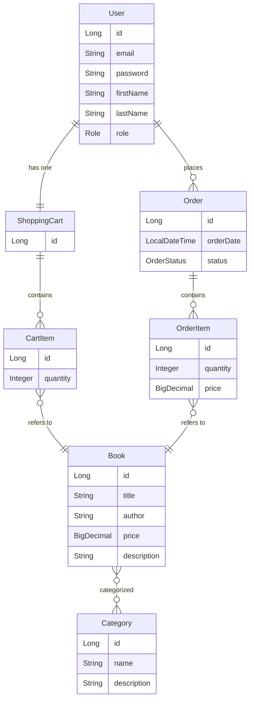

# 📚 Book Store REST API

This project is a backend-only Book Store application built with **Spring Boot**.  
It provides a secure REST API for managing books, categories, shopping carts, and orders.

The application supports two roles:

| Role  | Description |
|------|-------------|
| `USER`  | Can browse books, manage personal shopping cart, place orders |
| `ADMIN` | Can create, update and delete books and categories |

---

## 🚀 Features

### Authentication & Authorization

- JWT-based authentication
- Role-based access control (`USER`, `ADMIN`)

### Book Management

- List all books (USER)
- Create / Update / Delete books (ADMIN)
- Search books by filters
- View books by category

### Shopping Cart

- Add items to cart (USER)
- Update quantities
- View and remove cart items

### Orders

- Place orders from cart (USER)
- View order history
- View individual order items
- Update order status (ADMIN)

---

## 🧱 Technologies Used

| Technology | Purpose |
|-----------|---------|
| Java 17 | Language |
| Spring Boot | Application framework |
| Spring Security + JWT | Auth and security |
| Spring Data JPA | ORM / Repository layer |
| Hibernate | JPA provider |
| Swagger / OpenAPI | API documentation |
| MySQL | Database |
| Docker & Docker Compose | Containerization |

---

## 🗂️ Project Structure (Main Modules)

controller/ → API REST controllers
service/ → Business logic
repository/ → Spring Data JPA repositories
model/ → JPA entities
dto/ → Request/Response DTOs
security/ → JWT filters and authentication logic

---

## 🧩 Model Diagram

🐳 Running the Application with Docker

This project includes a preconfigured env.template file, which is used to supply environment variables during container
runtime.

1️⃣ Create the .env file

Before running the application, copy the template:

cp env.template .env

2️⃣ Open .env and update values if needed

You already have the necessary environment variables defined there.
Simply adjust them to match your local environment (e.g., MySQL password or ports).

⚠️ Important:
The .env file is meant for private configuration and should not be committed to the repository.
Make sure .env is listed in .gitignore.

3️⃣ Start the application
docker-compose up --build

This will automatically:

Start the MySQL database container

Start the Spring Boot application container

Apply schema and create tables

Expose the REST API on your configured port (example: http://localhost:8080/)

🔌 Swagger API Documentation

After the application starts successfully, open:

http://localhost:8080/swagger-ui/index.html

This provides interactive documentation and allows testing endpoints directly in the browser.

📦 Postman Collection

To make API testing easy, this project includes a ready-to-use Postman collection.

👉 **Download Postman Collection:**  
[Download Postman Collection](postman/bookapp_collection.json)

Import it into Postman and use your JWT token in **Authorization → Bearer Token**.
👨‍💻 Author

Anastasiia Beshleha(Abeshle)

📧 anastasiiabeshleha@gmail.com

If you found this project useful — ⭐ star the repo!